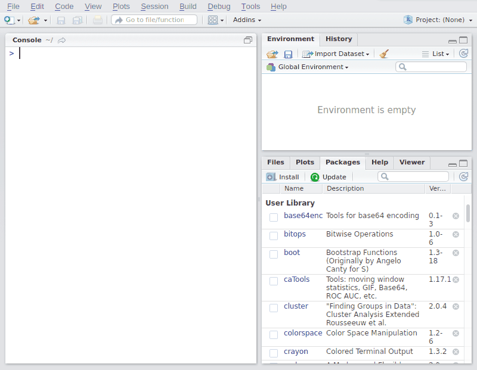

# BarcodeCompare
For comparing the similarity between tubes on two barcoded 96-well plates.



## Requirements
*Internet connection
*Shiny package

If you dont have Shiny installed on your current version of R, run the commands below:

```
install.packages("shiny", dependencies=T)
library(shiny)
```

## Run 

To run the code type the command below.

```
library(devtools)
runGitHub("/BarcodeCompare/", "michaelway")

```

## ShinyApp

If you dont fancy running it locally the app is hosted at shinyapps.io:

https://michaelway.shinyapps.io/BarcodeCompare/


## Feedback

I would love to hear any feedback, comments or suggestions for this app.

Enjoy!
